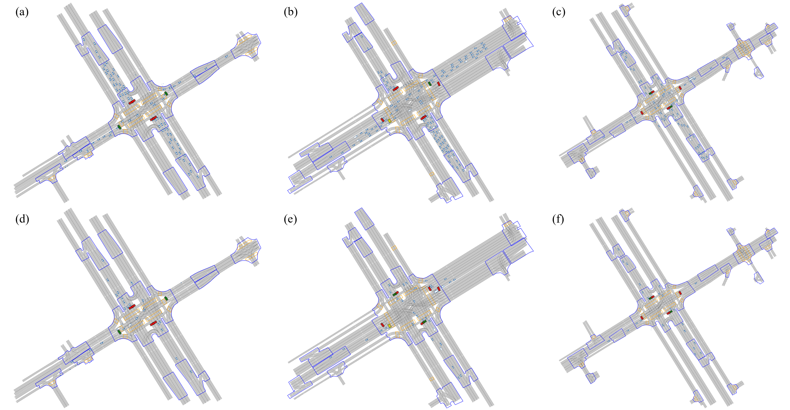
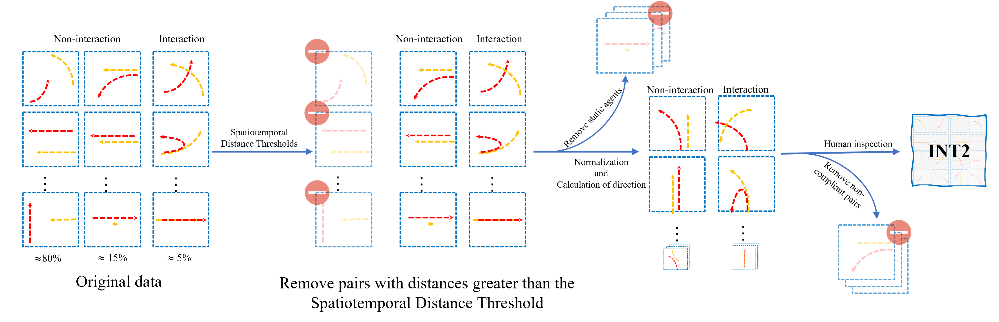
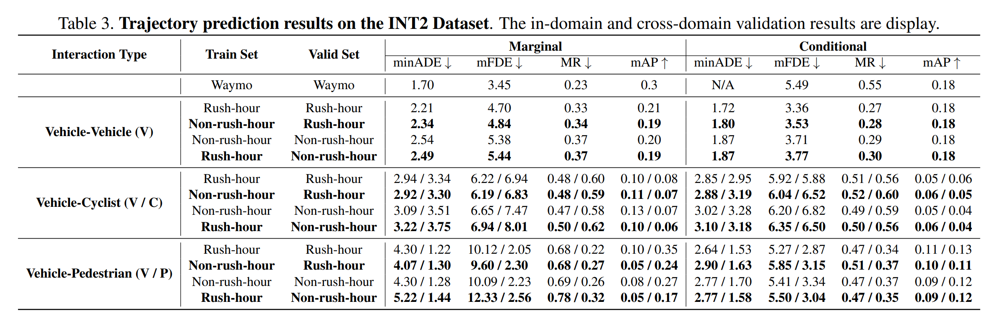

<h1 align="center">INT2: Interactive Trajectory Prediction at Intersections [ICCV-2023]</h1>

<p align="center">
<a href="https://int2.cn/"></a>
<a href="https://arxiv.org/"></a>
<a href="https://arxiv.org/"></a>
<a href="https://github.com/AIR-DISCOVER/INT2/blob/main/LICENSE"></a>
<a href="https://youtu.be/KNkuakDvgVc"></a>
</p>
<h3 align="center">This is the official repository of the paper <a href='"https://arxiv.org'>INT2: Interactive Trajectory Prediction at Intersections.</a></h3>

<h4 align="center"><em><a href="https://github.com/BJHYZJ">Zhijie Yan</a>, Pengfei Li, Zheng Fu, Shaocong Xu, Yongliang Shi, Xiaoxue Chen, Yuhang Zheng, Yang Li, Tianyu Liu, Chuxuan Li, Nairui Luo, Xu Gao, Yilun Chen, Zuoxu Wang, Yifeng Shi, Pengfei Huang, Zhengxiao Han, Jirui Yuan, Jiangtao Gong, Guyue Zhou, <a href="https://hangzhaomit.github.io/">Hang Zhao</a>, <a href="https://sites.google.com/view/fromandto">Hao Zhao</a></em></h4>

<h5 align="center">Sponsored by Baidu Inc. through <a href="https://www.apollo.auto/">Apollo</a>-<a href="https://air.tsinghua.edu.cn/en/">AIR</a> Joint Research Center.</h5>

<h4 align="center">
<a href='https://arxiv.org'>arXiv</a> | <a href='https://int2.cn'>INT2 Website</a> | <a href='https://int2.cn/download'>Dataset Download</a> | <a href='https://youtu.be/KNkuakDvgVc'>Video</a>
</h4>

<a align="docs/images/pic1.png"></a>

## Abstract
Motion forecasting is an important component in autonomous driving systems. One of the most challenging problems in motion forecasting is interactive trajectory prediction, whose goal is to jointly forecasts the future trajectories of interacting agents.
To this end, we present a large-scale interactive trajectory prediction dataset named <strong>INT2</strong> for <strong>INT</strong>eractive trajectory prediction at <strong>INT</strong>ersections. 
INT2 includes 612,000 scenes, each lasting 1 minute, containing up to 10,200 hours of data. 
The agent trajectories are auto-labeled by a high-performance offline temporal detection and fusion algorithm, whose quality is further inspected by human judges. Vectorized semantic maps and traffic light information are also included in INT2.
Additionally, the dataset poses an interesting domain mismatch challenge. 
For each intersection, we treat rush-hour and non-rush-hour segments as different domains.
We benchmark the best open-sourced interactive trajectory prediction method on INT2 and Waymo Open Motion, under in-domain and cross-domain settings.


<h4 align='left'>Additionally, the dataset poses an interesting domain mismatch challenge. For each intersection, we treat rush-hour and
non-rush-hour segments as different domains. Peak time (a, b, c) and trough time (d, e, f).</h4>
<a align='center'></a>


<hr>

<h3><strong><i>🚀 News</i></strong></h3>

><h4>[coming soon]: INT2 Motion Prediciton Challenge 2023 and INT2 Interactive Motion Prediction Challenge 2023 in this <a href="https://int2.cn/challenges">challenges page</a>.</h4>
>
><h4>[2023-8-9]: The INT2 Dataset, Benchmark, Visulization toolbox and Interaction filter toolbox are released in this <a href="https://github.com/AIR-DISCOVER/INT2">code-base page</a>.</h4>
>
><h4>[2023-8-8]: The INT2 Dataset Website are open in this <a href="https://int2.cn">website page</a>.</h4>
> 
<br>

## Getting Started

- <h3><strong><a href='docs/INSTALL.md'>Installation</a></strong></h3>
- <h3><strong><a href='docs/DATA_STRUCTURE.md'>Data structure</a></strong></h3> 


## Interaction Define Pipeline
<h4 align='left'>We propose an algorithm that enables us to efficiently mine our vast dataset for interactions of research value.</h4>
<a align="center"></a>

<h4 align='left'>INT2 includes interactions between vehicles-vehicles, vechile-cyclist, and vehicle-pedestrian:</h4>
<a align='center'></a>

<h4 align='left'>Retrieve the interaction within the scenario dataset:</h4>

```
python interaction_filter.py --scenario_path int2_dataset_example/scenario/0/010213250706-010213264206.pickle --output_dir
 int2_dataset_example/interaction_scenario/complete_scenario
```

<h4 align='left'>Split the complete interactive scenario into interactive scenarios with a length of 9.1 seconds:</h4>

```
python split_interaction.py --interaction_scenario_path int2_dataset_example/interaction_scenario/complete_scenario/0/010213250706-010213264206.pickle --output_dir int2_dataset_example/interaction_scenario/split_scenario
```

## Visualization
<h4 align='left'>The visualization of the complete interactive scenario:</h4>

```
python vis_interaction_scenario.py --scenario_path int2_dataset_example/interaction_scenario/complete_scenario/0/010213250706-010213264206.pickle
```

<h4 align='left'>The results will be saved by default in the output/visualization folder, including an XML file in CommonRoad format, frame-by-frame visualization images, and a complete video.</h4>

<h4 align='left'>The visualization of the interactive scenario segments split into 9.1-second lengths.</h4>

```
python vis_split_interaction_scenario.py --scenario_path int2_dataset_example/interaction_scenario/complete_scenario/0/010
213250706-010213264206.pickle
```

<h4 align='left'>Multiple XML files, visualization images, and videos with a length of 9.1 seconds will be saved by default in the output/visualization folder.</h4>

## Calculate Collision
<h4 align="left">We report collision rates so that they function as baselines for potential trajectory generation (instead of trajectory forecasting) applications. Generated trajectories should be as collision-free as possible, under the criteria mentioned above. To calculate collision: </h4>

```
python calculate_collision.py --scenario_path int2_dataset_example/scenario/0/010213250706-010213264206.pickle --hdmap_dir int2_dataset_example/hdmap
```

## Benchmark
<h4 align='left'>We used <a href="https://github.com/Tsinghua-MARS-Lab/M2I">M2I</a> and <a href="https://github.com/sshaoshuai/MTR">MTR</a> as benchmarks for our dataset, and the experimental results can be obtained from <a href="https://github.com/BJHYZJ/INT2forM2I">INT2forM2I</a> and <a href="https://github.com/BJHYZJ/INT2forMTR">INT2forMTR</a>.</h4>


<h4 align='left'>Quantitative results of M2I on our INT2 dataset.</h4>
<a align='center'></a>

<h4 align='left'>Quantitative results of M2I on our INT2 dataset.</h4>
<a align='center' style="color:red;"><strong>TODO</strong></a>

## Citation
<h4 align='left'>If you find this work useful in your research, please consider cite:</h4>


```
@article{yan2023int2,
  title={INT2: Interactive Trajectory Prediction at Intersections},
  author={Yan, Zhijie and Li, Pengfei and Fu, Zheng and Xu, Shaocong and Shi, Yongliang and Chen, Xiaoxue and Zheng, Yuhang and Li, Yang and Liu, Tianyu and Li, Chuxuan and Luo, Nairui and Gao, Xu and Chen, Yilun and Wang, Zuoxu and Shi, Yifeng and Huang, Pengfei and Han, Zhengxiao and Yuan, Jirui and Gong, Jiangtao and Zhou, Guyue and Zhao, Hang and Zhao, Hao},
  journal={International Conference on Computer Vision},
  year={2023}
}
```